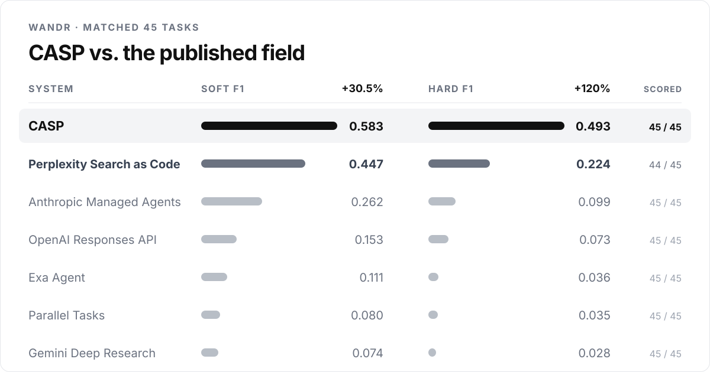
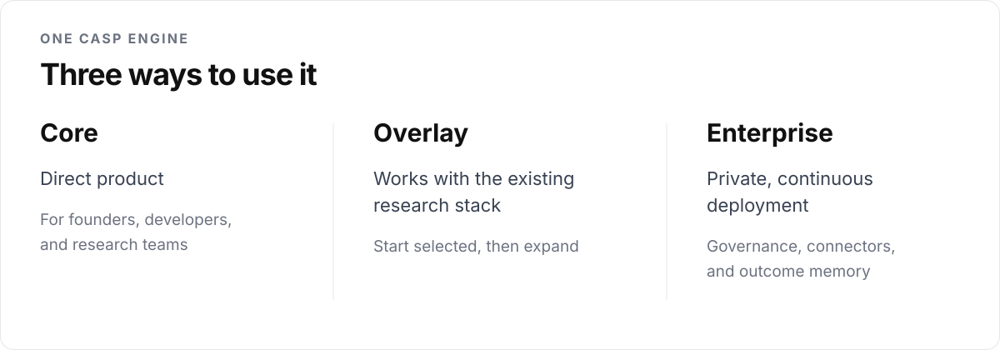

  

  <strong>Discover what conventional AI and research miss. Make the strongest next move clear. Learn from the outcome.</strong>

  <a href="https://caspianlabs.co">Website</a>&nbsp;&nbsp;·&nbsp;&nbsp;
  <a href="docs/PRODUCT.md">Product</a>&nbsp;&nbsp;·&nbsp;&nbsp;
  <a href="docs/EVIDENCE.md">Evidence</a>&nbsp;&nbsp;·&nbsp;&nbsp;
  <a href="SECURITY.md">Security</a>

---

## The strongest direction can be absent from a perfect answer

AI has become remarkably good at researching and executing a direction once it
is given. The expensive failure happens earlier. A team asks what to build,
enter, fund, or test, and the strongest direction never enters the comparison.

**Caspian Labs builds CASP, the opportunity-intelligence system that discovers
what conventional AI and research miss, makes the strongest next move clear,
and learns from the outcome.**

CASP searches beyond the obvious framing, constructs genuinely different
directions, completes the evidence needed to judge them, and concentrates a
team's limited attention on the strongest next move. It then records the
decision and what happened.

## An independently built system surpassed the published production field

Developed independently, CASP surpassed every published production research
system on the matched 45-task WANDR comparison. The field included systems from
Perplexity, Anthropic, OpenAI, Gemini, Exa, and Parallel.

WANDR does not reward one polished answer. Its wide-and-deep tasks require a
research system to map a large field, investigate the candidates, and support
the required records with evidence the evaluator independently checks.

  

CASP scored **0.583 soft F1** and **0.493 hard F1** under the official evaluator.
That was **30.5% higher** than the published leader on research quality and
coverage and **120% higher** on strict completion. CASP produced genuine
official scores on all 45 matched tasks, with no infrastructure zero-fills, and
reached **0.917 aggregate soft precision**.

The published comparator values come from [WANDR Table 6](https://arxiv.org/html/2608.14747v1#S5.T6).
CASP's aggregate metrics and preservation hashes are available in the
[public evidence record](evidence/wandr-s45/result.json). The claim is limited
to the identical matched 45-task surface. It is not a full-500 leaderboard claim
or an endorsement by the benchmark authors or compared companies.

## One research engine, three configurations

  

| Configuration | How CASP is used |
|---|---|
| **CASP Core** | Direct research for founders, developers, researchers, and product teams through a product interface, supported AI environment, or API. |
| **CASP Overlay** | Strengthens an existing research process. CASP can prove value with public and customer-selected evidence first, then add approved tools, exports, and sources. |
| **CASP Enterprise** | Runs the same engine with private deployment, governance, approved connectors, continuous research, team workflows, and organization-specific outcome memory. |

The systems beneath CASP do not need to be agentic. Models, agents, databases,
research platforms, files, and human judgment can all supply approved inputs.
CASP owns the discovery, investigation, decision, and learning loop above them.

## A separate test of opportunity prediction

CASP's technical lineage was also tested on a different question: could its
opportunity-ranking architecture place more of what would later matter inside a
tiny actionable shortlist?

In a historical clinical-development exam using public AACT and
ClinicalTrials.gov evidence, researchers could inspect only **9 of every 1,000**
possible treatment directions. The CASP lineage placed **47.6%** of the
directions later pursued in clinical trials inside that shortlist, **21.1% more**
than the matched strategy built with OpenAI's flagship GPT-5.6 Sol at the same
evidence and review workload. Exact replay reproduced the result.

This was a separate historical development test, not the WANDR evaluation. Its
exact artifact identity and boundaries are preserved in the
[clinical evidence record](evidence/clinical-opportunity/result.json).

## Why the advantage can compound

CASP sits above foundation models rather than competing to become another one.
A stronger model becomes a stronger component inside CASP. It does not recreate
the discovery architecture, evaluation machinery, integrations, or accumulated
decision history.

The long-term compounding asset is the Opportunity Outcome Graph: what was
knowable, what CASP surfaced, what a team chose or rejected, and what happened
later. Each real outcome can improve how the next opportunity field is searched,
tested, and prioritized.

## Public repository boundary

This repository is Caspian Labs' public company, product, and evidence surface.
It contains sanitized result summaries, high-level product documentation, and a
release audit.

It does **not** contain CASP's proprietary runtime, task compilers, search and
ranking implementation, evaluator reconstruction, repair system, private
receipts, datasets, customer material, or internal research infrastructure.

The public validation script is licensed under the
[MIT License](scripts/LICENSE). The repository's documentation, evidence
records, visual assets, Caspian Labs and CASP materials, private software, and
research artifacts remain separately protected. See [LICENSE](LICENSE) and
[TRADEMARK.md](TRADEMARK.md).
